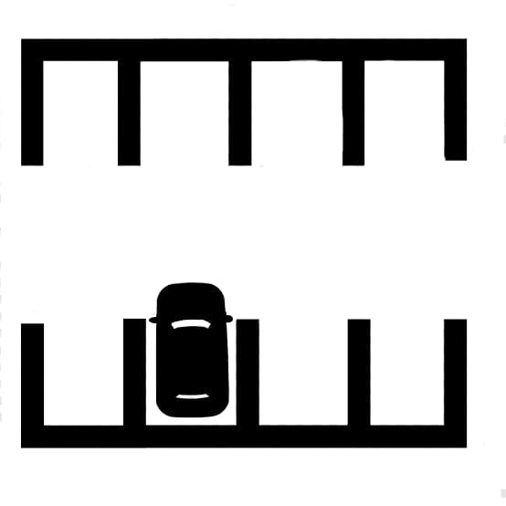

# Parking Slot Detection using OpenCV

This project demonstrates a simple method for detecting parking slots in an image using OpenCV. It processes a static image and highlights areas that represent empty parking spaces.

## 🧠 Features

- Image-based parking slot detection
- Uses contour and shape analysis
- Visual output with highlighted slots
- Simple, beginner-friendly OpenCV project

## 📁 Project Structure

```
ParkingSlotDetection-using-OpenCV/
├── code.py                  # Main Python script for detection
├── parking_slot.jpeg        # Sample input image of a parking lot
└── README.md                # Project documentation
```

## 🖼️ Input

Sample parking lot image:



## 🚀 Getting Started

### Prerequisites

- Python 3.x
- OpenCV

Install dependencies:
```bash
pip install opencv-python
```

### Run the code

```bash
python code.py
```

## 📌 How It Works

1. Loads the input image using OpenCV.
2. Converts the image to grayscale and applies thresholding.
3. Detects contours to find parking slot-like regions.
4. Draws bounding boxes around detected slots.

## 🛠️ Future Improvements

- Real-time video stream processing
- Integration with object detection models (e.g., YOLO, SSD)
- Dynamic parking slot mapping
- Dashboard to display available slots

## 🤝 Contributions

Contributions are welcome! Feel free to fork the repo and submit pull requests.

## 🧑‍💻 Author

- [Annant Parashar](https://github.com/annant-parashar)

## 📄 License

This project is open source and available under the [MIT License](LICENSE).
